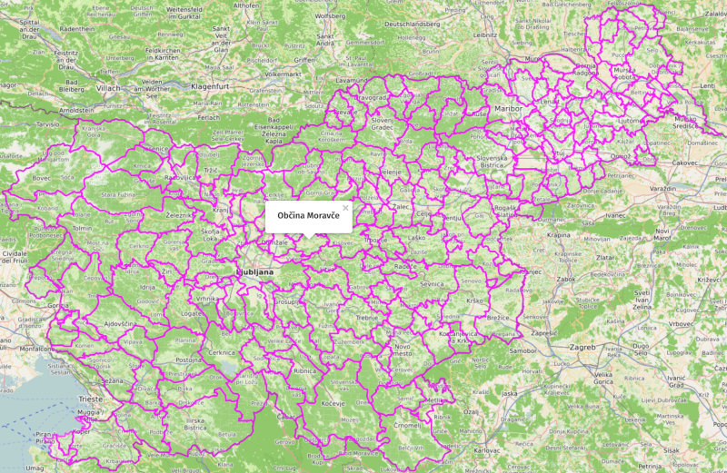

# GURS meje občin v Sloveniji / Municipality borders in Slovenia

[](https://umap.openstreetmap.fr/sl/map/obcine-v-sloveniji_440646)

## Rezultati / Results:

[Interaktivni zemljevid / Interactive Map](https://umap.openstreetmap.fr/sl/map/obcine-v-sloveniji_440646)

| Opis / Description                               | GeoJSON                         | CSV                     |
|--------------------------------------------------|---------------------------------|-------------------------|
| Občine / Municipalities                          | [OB.geojson](data/OB.geojson)   | [OB.csv](data/OB.csv)   |
| Naselja / Settlements                            | [NA.geojson](data/NA.geojson)   | [NA.csv](data/NA.csv)   |
| Upravne enote / Administrative units             | [UE.geojson](data/UE.geojson)   | [UE.csv](data/UE.csv)   |
| Statistične regije / Statistical regions         | [SR.geojson](data/SR.geojson)   | [SR.csv](data/SR.csv)   |
| Ožji deli občin / Municipality subdivisions      | [ODO.geojson](data/ODO.geojson) | [ODO.csv](data/ODO.csv) |
| Ulice / Streets                                  | [UL.geojson](data/UL.geojson)   | [UL.csv](data/UL.csv)   |
| Poštni okoliši / Postal districts                | [PT.geojson](data/PT.geojson)   | [PT.csv](data/PT.csv)   |
| Šolski okoliši / School districts                | [SL.geojson](data/SL.geojson)   | [SL.csv](data/SL.csv)   |
| Enote državnozborskih volitev / Voting districts | [VDV.geojson](data/VDV.geojson) | [VDV.csv](data/VDV.csv) |
| Enote lokalnih volitev / Voting districts        | [VLV.geojson](data/VLV.geojson) | [VLV.csv](data/VLV.csv) |
| Območne geodetske uprave / Administrative units  | [OG.geojson](data/OG.geojson)   | [OG.csv](data/OG.csv)   |
| Prostorski okoliši / Spatial districts           | [PO.geojson](data/PO.geojson)   | [PO.csv](data/PO.csv)   |

<!-- 
https://www.e-prostor.gov.si/fileadmin/struktura/sifrant_rpe_enot.htm 
-->

Atributi so opisani v [RPE_struktura.pdf](https://www.e-prostor.gov.si/fileadmin/struktura/RPE_struktura.pdf) / Attributes are described in [RPE_struktura.pdf](https://www.e-prostor.gov.si/fileadmin/struktura/RPE_struktura.pdf)

## Surovi podatki / Raw data

Shapefiles as obtained from the source are mirrored and published in this repository's releases.

## Vir podatkov / Source of data

[Geodetska Uprava Republike Slovenije](https://www.gov.si/drzavni-organi/organi-v-sestavi/geodetska-uprava/) / [The Surveying and Mapping Authority of Republic of Slovenia](https://www.gov.si/en/state-authorities/bodies-within-ministries/surveying-and-mapping-authority/)

Register prostorskih enot / Register od Spatial Units

Datum / Date: 2020-04-05

Dovoljenje / Licence: [CC-BY 2.5](http://creativecommons.org/licenses/by/2.5/si/legalcode) - [Pogoji uporabe](https://www.e-prostor.gov.si/fileadmin/struktura/preberi_me.pdf) / [Terms and conditions](https://www.e-prostor.gov.si/fileadmin/struktura/ANG/General_terms.pdf)

[Vir podatkov](https://egp.gu.gov.si/egp) / [Source of data](https://egp.gu.gov.si/egp/?lang=en)

## Tehnične podrobnosti / Technical details

Za osvežitev podatkov poženite / To refresh the data run:

```bash
$ make
```

Primer ukaza za pretvorbo posamezne zbirke podatkov / Example command for individual data conversion:

```bash
$ SHAPE_ENCODING=CP1250 ogr2ogr -progress -t_srs "EPSG:4326" \
  -f "GeoJSON" ./data/OB.geojson ./data/temp/OB \
  -lco RFC7946=YES -lco WRITE_BBOX=YES -mapFieldType Date=String
```
